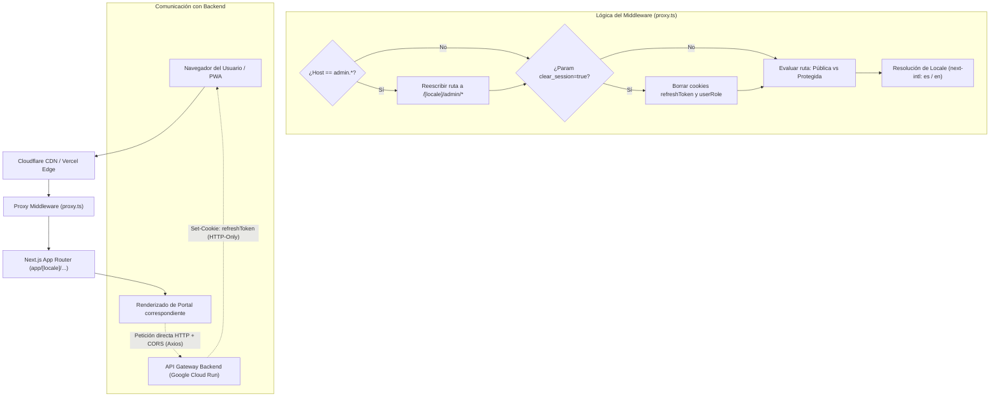

# 01 - Visión General de la Arquitectura del Frontend

**Documento:** `docs/architecture/01-system-overview.md`
**Estado:** Documentación derivada del repositorio; validar despliegue y configuración en runtime.
**Última actualización:** 2026-09-07
**Público:** Desarrolladores, Arquitectos y Agentes de IA (`engineering-product`, `platform-security-reliability`)

---

## 1. Introducción y Objetivos

El frontend de **QuHealthy** es una aplicación web multitenant construida con **Next.js 16 (App Router)** y **React 19**. Busca funcionar como punto de contacto unificado para los actores documentados del ecosistema de salud; el rendimiento y la disponibilidad deben evaluarse con métricas de cada entorno:

* **Consumidores:** Pacientes y sus familiares dependientes.
* **Profesionales y Entidades:** Médicos, clínicas, hospitales, laboratorios, proveedores de insumos y fundaciones.
* **Operación Interna:** Administradores y operadores de plataforma.
* **Asistente Inteligente:** Copilot clínico interactivo (**Health OS**).

El objetivo arquitectónico primordial es ofrecer una experiencia segura, reactiva, accesible e internacionalizada, manteniendo la modularidad y el aislamiento de dominios entre roles.

---

## 2. Diagrama de Flujo de Peticiones (Request Lifecycle)

---

## 3. Capa de Enrutamiento y Middleware (`proxy.ts`)

El archivo [`proxy.ts`](../../proxy.ts) (middleware de Next.js en este repositorio) contiene la lógica de las siguientes responsabilidades:

### A. Ruteo por Subdominio para el Portal de Administración
* El portal administrativo está accesible tanto vía ruta tradicional como a través de su propio subdominio: `admin.quhealthy.org` (o `admin.localhost` en desarrollo).
* Cuando una petición ingresa con este host, el middleware reescribe internamente la ruta hacia `/[locale]/admin/*` de forma transparente para el navegador.

### B. Prevención y Ruptura de Bucles de Redirección (*Kill Switch*)
* Si una cookie de sesión HTTP-only (`refreshToken` o `__Secure-userRole`) queda en un estado corrupto o con credenciales revocadas en el backend, los middlewares tradicionales suelen atrapar al usuario en un bucle infinito de redirecciones entre `/login` y el portal protegido.
* QuHealthy implementa un parámetro `?clear_session=true`. Cuando el middleware lo detecta, elimina inmediatamente las cookies de autenticación del contexto de la petición, permitiendo un aterrizaje limpio en el login.

### C. Exclusiones de Seguridad y Rutas Públicas Sensibles
* **Receta Médica Electrónica (`/patient/prescription/[token]`):** Ruta pública con identificador o token diseñada para visualizar y verificar recetas mediante código QR o enlace directo sin autenticación previa. La existencia de la ruta no certifica por sí sola la seguridad ni la autorización del backend.
* **Páginas de Registro y Onboarding:** Rutas dedicadas (`provider/register`, `supplier/register`, `foundation/register`) exentas de validaciones restrictivas de sesión.

### D. Negociación de Idioma (`next-intl`)
* Enrutamiento con prefijo de localización (`/es/...` por defecto, `/en/...` para inglés).
* Las preferencias se resuelven en [`i18n/routing.ts`](../../i18n/routing.ts) y [`i18n/request.ts`](../../i18n/request.ts), cargando los diccionarios JSON desde [`messages/`](../../messages/).

---

## 4. Comunicación con el Backend y Decisión Arquitectónica Clave

### ⚠️ Eliminación del *Rewrite Proxy* en Next.js
La configuración actual debe verificarse en `next.config.ts` y en el cliente HTTP antes de asumir un modo de transporte. Las limitaciones de cookies en un *rewrite* dependen de la implementación del backend, el navegador y la configuración de despliegue.

**Solución Actual:**
1. El cliente web se comunica directamente con el backend mediante `NEXT_PUBLIC_API_URL` (ej. `https://api.quhealthy.org`).
2. La configuración CORS del backend debe validarse en su despliegue y pruebas de integración.
3. La instancia compartida de [`lib/axios.ts`](../../lib/axios.ts) usa `withCredentials: true`; las llamadas que no la usan requieren revisión específica.

### 🛡️ Idempotencia en Transacciones Financieras y Reservas
[`lib/idempotency.ts`](../../lib/idempotency.ts) genera la cabecera `Idempotency-Key` (UUIDv4) cuando el llamador la incorpora. En el código actual se observa su uso en flujos concretos de pagos y creación de citas; no demuestra por sí solo idempotencia del servidor ni cubre todas las escrituras, reservas u órdenes.

---

## 5. Seguridad Perimetral y Cabeceras (CSP)

[`next.config.ts`](../../next.config.ts) declara cabeceras HTTP de defensa; su efectividad requiere verificación en la respuesta servida:

* **Content-Security-Policy (CSP):**
  * `script-src`: Restringido a scripts propios, Stripe JS (`*.stripe.com`), Google Maps (`maps.googleapis.com`), Google OAuth (`accounts.google.com`), Cloudflare Turnstile (`challenges.cloudflare.com`) y Chatwoot.
  * `frame-src`: Restringido para iframes de Stripe Elements, Google Auth, Maps y Cloudflare.
  * `media-src`: LiveKit WebRTC y almacenamiento de assets (`storage.googleapis.com`).
* **X-Frame-Options:** `SAMEORIGIN` (previene ataques de clickjacking).
* **Strict-Transport-Security (HSTS):** `max-age=63072000; includeSubDomains; preload`.
* **X-Content-Type-Options:** `nosniff`.

---

## 6. Integración con el Sistema Health OS

A diferencia de un frontend tradicional compuesto únicamente de vistas estáticas, `quhealthy` cuenta con el motor **Health OS**:
* **Contrato local desacoplado:** Definido en [`packages/health-os-contract/`](../../packages/health-os-contract/), contiene esquemas tipados compartidos.
* **Motor de Renderizado Dinámico:** [`components/engine/WidgetRenderer.tsx`](../../components/engine/WidgetRenderer.tsx) mapea respuestas hacia widgets nativos según la implementación actual.
* **Action Engine:** [`hooks/useActionEngine.ts`](../../hooks/useActionEngine.ts) traduce eventos de widgets en navegación o llamadas HTTP según el caso.

*(Este componente se documenta a profundidad en la Iteración 3: `03-health-os-copilot.md`).*

---

## 7. Índice de la Documentación de Arquitectura

1. **01 - Visión General de la Arquitectura** (Este documento)
2. **02 - Portales, Ruteo y Matriz de Roles** (`02-routing-and-portals.md`)
3. **03 - Motor Health OS, Copilot y Widgets** (`03-health-os-copilot.md`)
4. **04 - Estado Global (Zustand), Hooks y Servicios** (`04-state-and-services.md`)
5. **05 - Integraciones Externas y Seguridad** (`05-integrations.md`)
