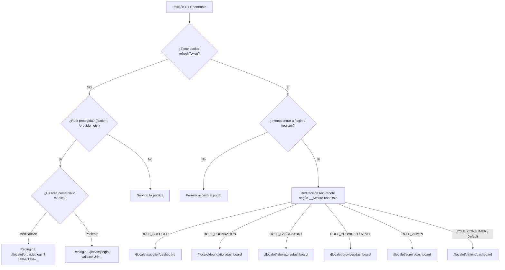

# 02 - Portales, Ruteo, Sitemap Completo y Matriz de Seguridad

**Documento:** `docs/architecture/02-routing-and-portals.md`
**Estado:** Activo / Exhaustivo
**Última actualización:** 2026-09-07
**Público:** Desarrolladores, Diseñadores de Producto y Agentes de IA (`engineering-product`, `product-market`, `platform-security-reliability`)

---

## 1. Introducción y Matriz de Roles

QuHealthy opera sobre una arquitectura multinquilino (*multi-portal*) con más de **180 páginas (`page.tsx`)** agrupadas mediante Next.js Route Groups.

Cada usuario posee un rol centralizado proveniente de su token JWT (emitido por `auth_service` del backend) y persistido en cookies HTTP-only (`refreshToken` y `__Secure-userRole`):

| Rol Técnico | Actor / Entidad | Portal Primario | Dashboard por Defecto | Guard de Acceso |
| :--- | :--- | :--- | :--- | :--- |
| `ROLE_CONSUMER` | Paciente / Familiar | `(platform)/patient` | `/patient/dashboard` | `proxy.ts` |
| `ROLE_PROVIDER` | Médico / Especialista / Clínica | `(platform)/provider` | `/provider/dashboard` | `proxy.ts` + `ProviderGuard.tsx` |
| `ROLE_STAFF` | Asistente / Recepcionista | `(platform)/provider` | `/provider/dashboard` | `proxy.ts` + `ProviderGuard.tsx` |
| `ROLE_LABORATORY` | Laboratorio Clínico | `(laboratory)/laboratory` | `/laboratory/dashboard` | `proxy.ts` |
| `ROLE_SUPPLIER` | Proveedor de Insumos / Farmacia | `(supplier)/supplier` | `/supplier/dashboard` | `proxy.ts` |
| `ROLE_FOUNDATION` | Fundación / Organización Social | `(foundation)/foundation` | `/foundation/dashboard` | `proxy.ts` |
| `ROLE_ADMIN` | Administrador de Plataforma | `admin/` | `/admin/dashboard` | `proxy.ts` (Subdominio `admin.quhealthy.org`) |

---

## 2. Mecanismo Perimetral de Seguridad y Anti-rebote (`proxy.ts`)

### Reglas Clave del Middleware:
1. **Preservación de Destino (`callbackUrl`):** Si un usuario no autenticado intenta ingresar a una ruta protegida (ej. `/patient/booking/pediatra-garcia`), el middleware guarda la ruta original para redirigirlo inmediatamente después de iniciar sesión.
2. **Anti-rebote:** Un usuario con sesión activa que visita `/login` o `/register` es automáticamente redirigido al dashboard de su rol, evitando formularios innecesarios.
3. **Mecanismo Kill Switch (`?clear_session=true`):** Elimina cookies de dominio para resolver bucles de redirección ocasionados por tokens expirados.
4. **Exclusiones Públicas:** La receta digital (`/patient/prescription/[id]`) y perfiles de proveedores/fundaciones omiten validaciones de login.

---

## 3. Inventario de Rutas del Repositorio (180 archivos `page.tsx`)

A continuación se detalla un inventario derivado del árbol `app/` al 2026-09-08. La existencia de una ruta no prueba que esté habilitada ni disponible en producción.

### A. Rutas Públicas y de Descubrimiento (`app/[locale]/(public)/`) - 24 páginas

| Ruta en Next.js | Parámetros Dinámicos | Acceso | Propósito |
| :--- | :--- | :--- | :--- |
| `/(public)` | Ninguno | Público | Landing page principal de QuHealthy |
| `/(public)/about` | Ninguno | Público | Misión, visión e historia corporativa |
| `/(public)/academy` | Ninguno | Público | Centro de cursos y educación para la salud |
| `/(public)/blog` | Ninguno | Público | Listado de artículos y noticias médicas |
| `/(public)/blog/[slug]` | `slug`: URL del artículo | Público | Lector de artículo con metadatos OpenGraph |
| `/(public)/budget/[folio]` | `folio`: Folio de cotización | Público | Vista y descarga de presupuesto formal |
| `/(public)/business` | Ninguno | Público | Propuesta de valor B2B para clínicas y empresas |
| `/(public)/careers` | Ninguno | Público | Bolsa de trabajo y vacantes en QuHealthy |
| `/(public)/checkout` | Ninguno | Público/Auth | Checkout unificado para compras de tienda pública |
| `/(public)/como-funciona-el-quscore` | Ninguno | Público | Explicación del algoritmo de score de salud |
| `/(public)/contact` | Ninguno | Público | Formulario de contacto y soporte general |
| `/(public)/cookies` | Ninguno | Público | Política legal de cookies |
| `/(public)/discover` | Ninguno | Público | Directorio público de especialistas y clínicas |
| `/(public)/facturacion` | Ninguno | Público | Portal de solicitud y descarga de CFDI |
| `/(public)/foundation/[id]` | `id`: ID de la fundación | Público | Perfil público de una fundación y sus causas |
| `/(public)/foundations` | Ninguno | Público | Directorio de fundaciones afiliadas |
| `/(public)/intelligence` | Ninguno | Público | Muestra de capacidades de Health OS y analítica |
| `/(public)/market` | Ninguno | Público | Catálogo del marketplace de insumos y farmacia |
| `/(public)/market/item/[slug]` | `slug`: Identificador de producto | Público | Detalle técnico, fotos y compra de producto |
| `/(public)/privacy` | Ninguno | Público | Aviso integral de privacidad (datos de salud) |
| `/(public)/returns` | Ninguno | Público | Política de cancelaciones y reembolsos |
| `/(public)/sitemap` | Ninguno | Público | Índice estructurado de páginas para SEO |
| `/(public)/store/[slug]` | `slug`: Slug de la tienda/médico | Público | Tienda personalizada de un doctor o clínica |
| `/(public)/suppliers` | Ninguno | Público | Directorio público de distribuidores médicos |
| `/(public)/terms` | Ninguno | Público | Términos y condiciones de uso de la plataforma |

---

### B. Flujos de Autenticación (`app/[locale]/(auth)/`) - 12 páginas

| Ruta en Next.js | Acceso | Propósito |
| :--- | :--- | :--- |
| `/(auth)/login` | Público (Anti-rebote) | Inicio de sesión unificado para pacientes/consumidores |
| `/(auth)/register` | Público (Anti-rebote) | Registro de nuevos pacientes |
| `/(auth)/provider/login` | Público (Anti-rebote) | Inicio de sesión exclusivo para profesionales médicos |
| `/(auth)/provider/register` | Público (Anti-rebote) | Registro de médicos y especialistas |
| `/(auth)/laboratory/register` | Público (Anti-rebote) | Registro de laboratorios de análisis clínicos |
| `/(auth)/supplier/register` | Público (Anti-rebote) | Registro de proveedores de insumos y farmacias |
| `/(auth)/foundation/register` | Público (Anti-rebote) | Registro de organizaciones y fundaciones |
| `/(auth)/staff/activate` | Público con token | Activación de cuenta para recepcionistas y asistentes |
| `/(auth)/forgot-password` | Público | Solicitud de enlace de restablecimiento de contraseña |
| `/(auth)/reset-password` | Público con token | Formulario para ingresar nueva contraseña |
| `/(auth)/verify-email` | Público con sesión pendiente | Pantalla de confirmación de correo electrónico |
| `/(auth)/verify-phone` | Público con sesión pendiente | Validación de número celular mediante código SMS/OTP |

---

### C. Flujo de Onboarding Unificado (`app/[locale]/onboarding/`) - 10 páginas

| Ruta en Next.js | Rol / Acceso | Propósito |
| :--- | :--- | :--- |
| `/onboarding` | Autenticado con onboarding pendiente | Pantalla orquestadora y checklist general |
| `/onboarding/profile` | Autenticado | Paso 1: Datos de perfil personal/profesional |
| `/onboarding/license` | `ROLE_PROVIDER` | Paso 2: Cédula médica, especialidad e institución |
| `/onboarding/kyc` | Todos los roles B2B | Paso 3: Identificación oficial y prueba de vida |
| `/onboarding/fiscal` | Todos los roles B2B | Paso 4: Carga de CSF, RFC y datos fiscales SAT |
| `/onboarding/patient` | `ROLE_CONSUMER` | Completado de perfil básico de salud del paciente |
| `/onboarding/staff/activate` | Token de invitación | Alta asistida vinculada al consultorio del médico |
| `/onboarding/laboratory` | `ROLE_LABORATORY` | Carga de licencias sanitarias COFEPRIS de laboratorio |
| `/onboarding/supplier` | `ROLE_SUPPLIER` | Licencias sanitarias de almacén y distribución |
| `/onboarding/foundation` | `ROLE_FOUNDATION` | Acta constitutiva y autorización de donataria |

---

### D. Portal del Paciente (`app/[locale]/(platform)/patient/` y `patient/`) - 39 páginas

| Ruta en Next.js | Parámetros Dinámicos | Propósito |
| :--- | :--- | :--- |
| `/patient/dashboard` | Ninguno | Panel central del paciente (próximas citas, QuScore) |
| `/patient/dashboard/appointments` | Ninguno | Historial y calendario de consultas del paciente |
| `/patient/appointments/[appointmentId]` | `appointmentId`: ID de la cita | Detalle de la cita, indicaciones previas y botones de acción |
| `/patient/booking/[slug]` | `slug`: Slug del doctor/servicio | Flujo interactivo de reserva médica |
| `/patient/booking/success/[appointmentId]` | `appointmentId`: ID de reserva | Pantalla de confirmación de cita y ticket |
| `/patient/booking/success/hybrid` | Ninguno | Confirmación de reserva mixta (consulta + estudio) |
| `/patient/video-call/[appointmentId]` | `appointmentId`: ID de cita | Sala de teleconsulta médica con WebRTC/LiveKit |
| `/patient/prescription/[id]` | `id`: Token seguro | Visualizador público y descargable de receta médica con QR |
| `/patient/dashboard/vault` | Ninguno | **Health Vault:** Expediente médico (análisis, recetas, estudios) |
| `/patient/dashboard/family` | Ninguno | Directorio de familiares dependientes |
| `/patient/dashboard/family/[id]/vaccinations` | `id`: ID del familiar | Esquema de vacunación del dependiente |
| `/patient/dashboard/family/[id]/growth` | `id`: ID del familiar | Tablas percentiles de crecimiento infantil (OMS) |
| `/patient/dashboard/family/[id]/eldercare` | `id`: ID del familiar | Bitácora y seguimiento para adultos mayores |
| `/patient/dependents/[id]/vaccinations` | `id`: ID del dependiente | Vista de vacunas alternativa para dependientes |
| `/patient/diabetes` | Ninguno | Seguimiento especializado de glucosa y bitácora diabética |
| `/patient/oncology` | Ninguno | Acompañamiento especializado oncológico |
| `/patient/dashboard/womens-health` | Ninguno | Calendario menstrual, fertilidad y salud ginecológica |
| `/patient/dashboard/nutrition` | Ninguno | Planes alimenticios y seguimiento de peso/composición |
| `/patient/dashboard/treatments` | Ninguno | Recordatorio de tomas de medicamentos activos |
| `/patient/dashboard/wallet` | Ninguno | Saldo en QuPoints, recargas y métodos de pago guardados |
| `/patient/wallet/success` | Ninguno | Confirmación de abono exitoso a la billetera |
| `/patient/dashboard/orders` | Ninguno | Pedidos de farmacia e insumos realizados en el marketplace |
| `/patient/dashboard/packages` | Ninguno | Paquetes de salud y membresías activas |
| `/patient/dashboard/courses` | Ninguno | Cursos de salud adquiridos |
| `/patient/dashboard/courses/[courseId]` | `courseId`: ID del curso | Aula virtual y reproductor de video del curso |
| `/patient/dashboard/favorites` | Ninguno | Médicos, clínicas y productos guardados como favoritos |
| `/patient/dashboard/messages` | Ninguno | Chat directo con consultorios y asistentes |
| `/patient/dashboard/reviews` | Ninguno | Mis valoraciones realizadas a médicos |
| `/patient/dashboard/reviews/leave/[token]` | `token`: Token de cita | Formulario para calificar una consulta completada |
| `/patient/dashboard/profile` | Ninguno | Información personal, alergias, tipo de sangre y contacto de emergencia |
| `/patient/dashboard/support` | Ninguno | Generación de tickets de ayuda y chat de soporte |
| `/patient/dashboard/settings` | Ninguno | Ajustes de notificaciones, idioma y tema |
| `/patient/dashboard/settings/security/password` | Ninguno | Cambio de contraseña de acceso |
| `/patient/dashboard/settings/security/2fa` | Ninguno | Configuración de autenticación de dos factores (TOTP) |
| `/patient/dashboard/settings/security/devices` | Ninguno | Gestión y cierre de sesiones activas |
| `/patient/dashboard/settings/security/alerts` | Ninguno | Alertas de actividad sospechosa por correo/SMS |
| `/patient/dashboard/settings/security/activity` | Ninguno | Bitácora de accesos recientes con IP y geolocalización |
| `/patient/dashboard/settings/security/delete-account`| Ninguno | Solicitud formal de borrado de cuenta bajo derecho ARCO |
| `/patient/discover` | Ninguno | Buscador de especialistas desde el portal privado |

---

### E. Portal del Médico / Proveedor (`app/[locale]/(platform)/provider/`) - 62 páginas

| Ruta en Next.js | Parámetros Dinámicos | Propósito |
| :--- | :--- | :--- |
| `/provider/dashboard` | Ninguno | Panel operativo del especialista (citas del día, métricas) |
| `/provider/dashboard/appointments` | Ninguno | Listado y gestión de citas de la clínica |
| `/provider/appointments/[id]/checkin` | `id`: ID de cita | Registro de llegada y check-in en sala de espera |
| `/provider/dashboard/calendar` | Ninguno | Agenda médica interactiva con vistas de calendario |
| `/provider/consultation/[id]` | `id`: ID de cita | **EHR:** Consulta clínica en vivo, notas SOAP y receta digital |
| `/provider/dashboard/patients` | Ninguno | Directorio de pacientes del médico |
| `/provider/dashboard/patients/[id]` | `id`: ID de paciente | Historial clínico completo y consultas previas del paciente |
| `/provider/dashboard/patient-budgets` | Ninguno | Presupuestos médicos emitidos a pacientes |
| `/provider/dashboard/patient-budgets/create` | Ninguno | Creador de presupuesto clínico y quirúrgico |
| `/provider/dashboard/templates` | Ninguno | Plantillas preconfiguradas de recetas y notas clínicas |
| `/provider/dashboard/documents` | Ninguno | Gestor de consentimientos informados y expedientes |
| `/provider/dashboard/emergencies` | Ninguno | Canal de atención a pacientes en condición prioritaria |
| `/provider/dashboard/messages` | Ninguno | Bandeja de mensajería con pacientes |
| `/provider/dashboard/cash-register` | Ninguno | Punto de venta (POS) y caja del consultorio para cobro presencial |
| `/provider/dashboard/billing` | Ninguno | Emisión de comprobantes fiscales CFDI para pacientes |
| `/provider/dashboard/marketing` | Ninguno | Herramientas de difusión y fidelización |
| `/provider/dashboard/referrals` | Ninguno | Red de interconsultas y médicos referentes |
| `/provider/dashboard/reviews` | Ninguno | Panel de calificaciones y opiniones de pacientes |
| `/provider/dashboard/history` | Ninguno | Auditoría y registro histórico de actividades |
| `/provider/dashboard/biomedical` | Ninguno | Centro de control de equipamiento biomédico |
| `/provider/dashboard/biomedical/equipments` | Ninguno | Inventario de aparatos médicos de la clínica |
| `/provider/dashboard/biomedical/equipments/[id]` | `id`: ID de equipo | Ficha técnica, calibraciones y mantenimientos del aparato |
| `/provider/dashboard/inventory` | Ninguno | Control de medicamentos y material de curación del consultorio |
| `/provider/dashboard/inventory/purchases` | Ninguno | Órdenes de compra enviadas a proveedores |
| `/provider/dashboard/inventory/suppliers` | Ninguno | Directorio de proveedores de confianza |
| `/provider/dashboard/orders` | Ninguno | Pedidos de insumos en curso |
| `/provider/dashboard/accounting` | Ninguno | Resumen de contabilidad interna de la clínica |
| `/provider/dashboard/accounting/accounts` | Ninguno | Catálogo de cuentas contables |
| `/provider/dashboard/accounting/cost-centers` | Ninguno | Centros de costos operativos |
| `/provider/dashboard/finance` | Ninguno | Panel general de finanzas y tesorería |
| `/provider/dashboard/finance/accounting` | Ninguno | Pólizas contables y libros de registro |
| `/provider/dashboard/finance/accounting/accounts` | Ninguno | Subcuentas financieras |
| `/provider/dashboard/finance/accounting/journals` | Ninguno | Libro diario de transacciones |
| `/provider/dashboard/finance/accounting/journals/create` | Ninguno | Creación manual de póliza contable |
| `/provider/dashboard/finance/accounting/mapping` | Ninguno | Mapeo de cuentas a conceptos fiscales SAT |
| `/provider/dashboard/finance/approvals` | Ninguno | Flujo de autorización de gastos de la clínica |
| `/provider/dashboard/finance/budgets` | Ninguno | Presupuestos anuales o mensuales del consultorio |
| `/provider/dashboard/finance/budgets/[id]` | `id`: ID de presupuesto | Detalle de partidas y ejecución presupuestal |
| `/provider/dashboard/finance/budgets/[id]/calendar` | `id`: ID de presupuesto | Calendario de erogaciones planificadas |
| `/provider/dashboard/finance/budgets/transfers` | Ninguno | Traspasos entre partidas presupuestarias |
| `/provider/dashboard/finance/executions` | Ninguno | Pagos y salidas de dinero ejecutadas |
| `/provider/dashboard/finance/executions/commitments` | Ninguno | Compromisos y órdenes de pago pendientes |
| `/provider/dashboard/finance/reports` | Ninguno | Reportes de balance y estado de resultados |
| `/provider/dashboard/finance/settings` | Ninguno | Configuración fiscal y bancaria de finanzas |
| `/provider/dashboard/finance/settings/cost-centers` | Ninguno | Mantenimiento de centros de costos |
| `/provider/dashboard/finance/settings/policies` | Ninguno | Políticas de límites de gasto por usuario |
| `/provider/store` | Ninguno | Configuración de la tienda pública del consultorio |
| `/provider/store/catalog` | Ninguno | Catálogo de consultas, cirugías y estudios en venta |
| `/provider/store/identity` | Ninguno | Logotipo, colores y presentación de la clínica |
| `/provider/store/staff` | Ninguno | Gestión de médicos colaboradores y asistentes |
| `/provider/store/policies` | Ninguno | Políticas de cancelación y reprogramación |
| `/provider/store/integrations` | Ninguno | Conexión con calendarios externos (Google Calendar) |
| `/provider/settings/prescription` | Ninguno | Personalización de membrete y firma de recetas |
| `/provider/dashboard/profile` | Ninguno | Perfil profesional, bio, foto y especialidades |
| `/provider/dashboard/settings` | Ninguno | Ajustes generales del consultorio |
| `/provider/dashboard/settings/billing/success` | Ninguno | Confirmación de suscripción SaaS a QuHealthy |
| `/provider/dashboard/settings/security/password` | Ninguno | Cambio de contraseña de acceso |
| `/provider/dashboard/settings/security/2fa` | Ninguno | Configuración de 2FA obligatorio para expedientes |
| `/provider/dashboard/settings/security/devices` | Ninguno | Auditoría de dispositivos conectados |
| `/provider/dashboard/settings/security/alerts` | Ninguno | Alertas de accesos fuera de horario |
| `/provider/dashboard/settings/security/activity` | Ninguno | Registro de actividad clínica y descargas |
| `/provider/dashboard/settings/security/delete-account`| Ninguno | Baja de prestador y resguardo legal de expedientes |

---

### F. Portal de Laboratorios (`app/[locale]/(laboratory)/laboratory/`) - 5 páginas

| Ruta en Next.js | Propósito |
| :--- | :--- |
| `/laboratory/dashboard` | Métricas de estudios procesados, tiempos de entrega e ingresos |
| `/laboratory/orders` | Bandeja de órdenes de laboratorio enviadas por médicos o pacientes |
| `/laboratory/results` | Interfaz de captura de parámetros y subida de archivos PDF firmados |
| `/laboratory/compliance` | Acreditaciones ISO/sanitarias y licencias de operación |
| `/laboratory/store` | Catálogo público de perfiles analíticos y estudios en venta |

---

### G. Portal de Proveedores de Insumos (`app/[locale]/(supplier)/supplier/`) - 7 páginas

| Ruta en Next.js | Propósito |
| :--- | :--- |
| `/supplier/dashboard` | Tablero de ventas B2B, pedidos por surtir y cotizaciones |
| `/supplier/products` | Gestión de medicamentos, material de curación y dispositivos |
| `/supplier/inventory` | Control de stock por almacén con alertas de fecha de caducidad |
| `/supplier/orders` | Seguimiento de empaque, recolección y entrega a consultorios |
| `/supplier/quotes` | Recepción y respuesta a solicitudes de cotización formal (RFQ) |
| `/supplier/rentals` | Contratos y calendario de renta de equipo médico |
| `/supplier/cold-chain` | Telemetría y bitácora de temperatura para biológicos y vacunas |

---

### H. Portal de Fundaciones (`app/[locale]/(foundation)/foundation/`) - 17 páginas

| Ruta en Next.js | Propósito |
| :--- | :--- |
| `/foundation/dashboard` | Pacientes asistidos, fondos aplicados y programas en curso |
| `/foundation/programs` | Programas de ayuda médica (cirugías gratuitas, brigadas, prevención) |
| `/foundation/beneficiaries` | Censo y expediente social de beneficiarios registrados |
| `/foundation/subsidies` | Autorización y dispersión de subsidios para consultas o tratamientos |
| `/foundation/campaigns` | Campañas públicas de recaudación y voluntariado |
| `/foundation/social-bi` | Tablero de impacto social y métricas de retorno para donantes |
| `/foundation/team` | Gestión de equipo directivo y voluntarios |
| `/foundation/store` | Tienda de causas sociales o servicios subsidiados |
| `/foundation/store/programs` | Programas en exhibición dentro de la tienda |
| `/foundation/store/identity` | Personalización visual e institucional de la fundación |
| `/foundation/store/team` | Miembros públicos del patronato |
| `/foundation/settings` | Ajustes de cuenta y datos fiscales de donataria |
| `/foundation/settings/security/password` | Gestión de contraseña |
| `/foundation/settings/security/2fa` | Configuración de doble factor |
| `/foundation/settings/security/devices` | Auditoría de dispositivos del equipo |
| `/foundation/settings/security/alerts` | Notificaciones de transferencias y accesos |
| `/foundation/settings/security/delete-account` | Procedimiento de cierre institucional |

---

### I. Portal de Administración Central (`app/[locale]/admin/`) - 2 páginas

| Ruta en Next.js | Acceso | Propósito |
| :--- | :--- | :--- |
| `/admin/login` | Público | Formulario de autenticación administrativa con 2FA |
| `/admin/dashboard` | `ROLE_ADMIN` | Tablero ejecutivo consolidado con 9 sub-paneles (`TabExecutivePulse`, `TabAdminCrm`, `TabAdminSocialConnections`, `TabFinances`, `TabUnitEconomics`, `TabProductAnalytics`, `TabMedicalOperations`, `TabFoundations`, `TabSystemHealth`) |

---

### J. Health OS Copilot (`app/[locale]/(platform)/copilot/`) - 1 página

| Ruta en Next.js | Acceso | Propósito |
| :--- | :--- | :--- |
| `/copilot` | Autenticado | Asistente clínico inteligente multi-intención con renderizado de widgets interactivos y mascota reactiva Pulso |

---

## 4. Matriz de Autorización: Qué se PUEDE y qué NO se PUEDE hacer por Rol

| Capacidad / Acción | Paciente (`CONSUMER`) | Médico (`PROVIDER`) | Staff de Clínica | Laboratorio | Proveedor de Insumos | Fundación | Administrador |
| :--- | :---: | :---: | :---: | :---: | :---: | :---: | :---: |
| **Agendar citas médicas** | ✅ Sí | ❌ No (agenda por paciente) | ✅ Sí (en mostrador) | ❌ No | ❌ No | ✅ Sí (subsidiada) | ❌ No |
| **Ver notas clínicas SOAP** | ❌ No (solo resumen) | ✅ Sí (propias) | ❌ No | ❌ No | ❌ No | ❌ No | ❌ No |
| **Emitir y firmar recetas** | ❌ No | ✅ Sí | ❌ No | ❌ No | ❌ No | ❌ No | ❌ No |
| **Subir resultados de análisis**| ❌ No | ❌ No | ❌ No | ✅ Sí | ❌ No | ❌ No | ❌ No |
| **Modificar catálogo de insumos**| ❌ No | ❌ No | ❌ No | ❌ No | ✅ Sí | ❌ No | ❌ No |
| **Dispersar subsidios** | ❌ No | ❌ No | ❌ No | ❌ No | ❌ No | ✅ Sí | ❌ No |
| **Ver telemetría de microservicios** | ❌ No | ❌ No | ❌ No | ❌ No | ❌ No | ❌ No | ✅ Sí |
| **Acceso a Health Vault ajeno**| ❌ No | ⚠️ Solo con cita/permiso | ❌ No | ⚠️ Solo orden asignada | ❌ No | ❌ No | ❌ No |

---

## 5. Flujos Críticos de Negocio y Validaciones del Lado del Cliente

A continuación se documentan las validaciones exactas y la lógica de negocio en cliente para los flujos esenciales:

### Flujo 1: Agendamiento y Pago de Citas (`/patient/booking/[slug]`)
* **Librerías:** React Hook Form + validaciones de estado.
* **Secuencia:**
  1. **Selección de Especialista/Servicio:** Validación de que el servicio esté activo y tenga precio asignado.
  2. **Selección de Fecha y Horario:** Petición a `/api/schedule` para verificar disponibilidad en tiempo real. Bloqueo temporal del slot para evitar sobreventas concurrentes.
  3. **Selección de Paciente:** Validación de si la cita es para el titular o para un familiar dependiente (`dependentId`).
  4. **Captura de Síntomas:** Campo de texto obligatorio (mínimo 10 caracteres) describiendo el motivo de consulta.
  5. **Consentimiento de Expediente:** Checkbox para autorizar al médico a consultar el *Health Vault*.
  6. **Procesamiento de Pago:**
     * Si el saldo de QuPoints cubre el 100%: descuento directo sin Stripe.
     * Si es con tarjeta: el flujo puede enviar una clave `Idempotency-Key`; la prevención de duplicados requiere verificación en el backend y Stripe.

---

### Flujo 2: Consulta Médica Presencial/Teleconsulta y Emisión de Receta (`/provider/consultation/[id]`)
* **Librerías:** Formulario reactivo con validación de tipos médicos.
* **Secuencia:**
  1. **Apertura de Consulta:** Solo habilitada si la cita está en estado `CONFIRMED` o `IN_PROGRESS` y el usuario autenticado es el médico asignado o staff con permisos.
  2. **Estructura SOAP:**
     * **S (Subjetivo):** Motivo de consulta y síntomas relatados.
     * **O (Objetivo):** Signos vitales (Presión arterial, FC, FR, Temperatura, Saturación de O2, Glucosa). Validación de rangos fisiológicos lógicos.
     * **A (Análisis/Diagnóstico):** Búsqueda asistida en catálogo CIE-10. Al menos un diagnóstico principal obligatorio.
     * **P (Plan):** Indicaciones terapéuticas y estilo de vida.
  3. **Emisión de Receta Médica:**
     * Medicamento (nombre genérico y comercial).
     * Dosis, frecuencia (horas) y duración (días).
     * Cédula profesional y firma digitalizada del médico.
     * Al guardar, el backend genera el PDF sellado y el código QR accesible en `/patient/prescription/[id]`.

---

### Flujo 3: Teleconsulta Médica en Vivo (`/patient/video-call/[appointmentId]`)
* **Tecnología:** WebRTC mediante LiveKit (`LiveKit Client 2.20` + `TeleconsultationStore`).
* **Reglas de Conexión:**
  1. No se permite el acceso con más de 15 minutos de anticipación ni después de 60 minutos de concluido el horario de la cita.
  2. Solicitud previa de permisos de cámara y micrófono con validación de dispositivos vía `useMediaDevices`.
  3. Reintento automático de conexión con reconexión suave ante variaciones de ancho de banda.
  4. Temporizador visible en pantalla que alerta al médico y al paciente sobre el tiempo restante de consulta.

---

### Flujo 4: Carga y Entrega de Resultados de Laboratorio (`/laboratory/results`)
* **Reglas de Validación:**
  1. La orden debe estar previamente vinculada a una muestra recibida.
  2. Archivo adjunto: Formato PDF estricto con tamaño máximo de 10 MB.
  3. Captura opcional de biomarcadores numéricos estructurados (ej. Glucosa en ayuno: 95 mg/dL) para graficación en el expediente del paciente.
  4. Firma electrónica o confirmación del responsable sanitario del laboratorio.
  5. Al publicar, se dispara un evento de notificación que hace visible el resultado en el *Health Vault* del paciente en tiempo real.

---

### Flujo 5: Onboarding Progresivo y Verificación de Cédula (`/onboarding/*`)
* **Lógica del Guard (`ProviderGuard.tsx`):**
  1. Si un médico recién registrado inicia sesión, el sistema evalúa `status.onboardingComplete`.
  2. Si es `false`, se fuerza la navegación a `/onboarding`.
  3. Al completar la carga de cédula médica (SEP/DGP), el cliente llama a `onboardingService.finalizeOnboarding()` y refresca el estado en el backend para evitar bloqueos por tokens obsoletos.
