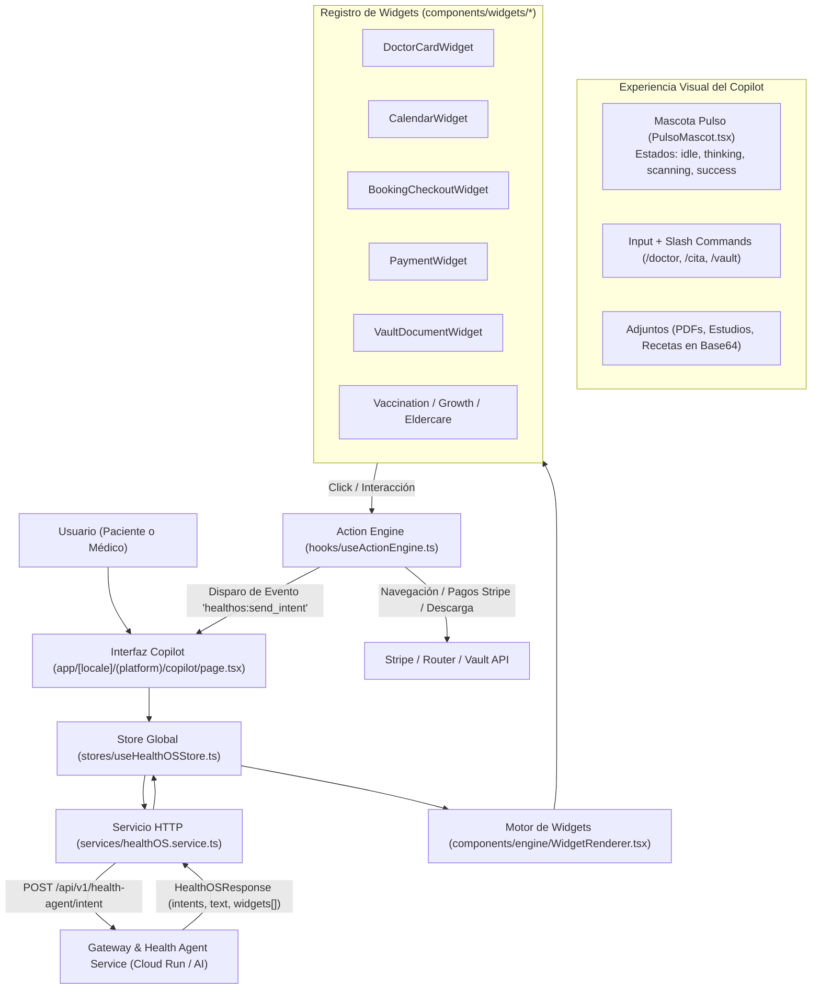

# 03 - Motor Health OS: Copilot, Widgets y Action Engine

**Documento:** `docs/architecture/03-health-os-copilot.md`
**Estado:** Activo / Exhaustivo
**Última actualización:** 2026-09-08
**Público:** Desarrolladores Frontend, Ingenieros de IA y Agentes de Arquitectura (`engineering-product`, `data-ai-intelligence`)

---

## 1. Introducción y Filosofía de Health OS

**Health OS** es la capa de inteligencia clínica e interfaz generativa de QuHealthy. A diferencia de un chatbot conversacional convencional que solo entrega respuestas en texto plano, Health OS opera como un **sistema operativo interactivo basado en intenciones**:

* **Texto + Interfaz Generativa (*Generative UI*):** Cada respuesta del agente de IA puede combinar una explicación empática con una secuencia de **widgets interactivos nativos** (`BaseWidget[]`).
* **Acciones Ejecutables sin Salir del Chat:** El usuario puede seleccionar horarios en un calendario interactivo, elegir a qué familiar dependiente corresponde la consulta, confirmar la cita y pagar con Stripe o QuPoints sin abandonar la conversación.
* **Arquitectura Orientada a Contratos:** El repositorio contiene un contrato local desacoplado en [`@quhealthy/health-os-contract`](../../packages/health-os-contract/); la compatibilidad efectiva con el backend de IA debe verificarse mediante pruebas de contrato.

---

## 2. Diagrama de Arquitectura de Health OS



---

## 3. Especificación del Contrato (`@quhealthy/health-os-contract`)

Ubicado en [`packages/health-os-contract/src/`](../../packages/health-os-contract/src/), este paquete local de TypeScript define estructuras compartidas:

### A. Estructura de Respuesta Principal (`HealthOSResponse`)
```typescript
export interface HealthOSResponse {
  id: string;              // Identificador único de la respuesta
  timestamp: string;       // Marca de tiempo ISO-8601
  intent?: HealthOSIntent; // Intención clasificada por el LLM
  text?: string;           // Texto explicativo o conversacional
  widgets?: BaseWidget[];  // Secuencia de componentes visuales a renderizar
  isComplete: boolean;     // Soporte para streaming de respuestas
}
```

### B. Catálogo de Intenciones del Sistema (`intents.ts`)
El clasificador de lenguaje natural del backend mapea los mensajes del usuario a intenciones predefinidas con entidades extraídas:

* `SearchDoctorIntent`: Búsqueda de especialistas con filtros de especialidad, ubicación y fecha (`specialty`, `location`, `availabilityDate`).
* `ScheduleAppointmentIntent`: Intención directa de agendar (`doctorId`, `doctorName`, `preferredTime`).
* `FindAppointmentIntent`: Consulta de citas programadas del paciente.
* `QueryVaultIntent`: Búsqueda en el expediente clínico digital (*Health Vault*).
* `UploadDocumentIntent`: Envío de documentos o recetas para análisis.
* `GetBiometricsIntent`: Consulta de glucemia, presión arterial o signos vitales.
* `GetQuScoreIntent`: Consulta de la puntuación de salud general del usuario.
* `RegisterMeasurementIntent`: Registro de nueva medición biométrica.
* `FindMedicationIntent`: Localización de fármacos en el marketplace.
* `UnknownIntent`: Consulta general o fuera de dominio médico.

### C. Catálogo de Acciones (`actions.ts`)
Eventos que un widget puede despachar hacia el motor ejecutor ([`useActionEngine.ts`](../../hooks/useActionEngine.ts)):

| Acción | Carga Útil (*Payload*) | Comportamiento en Frontend |
| :--- | :--- | :--- |
| `navigate` | `{ route: string, params?: object }` | `router.push(route)` a una vista del portal |
| `open` | `{ url: string, target?: '_blank' }` | `window.open(url)` a un enlace externo |
| `reserve` | `{ entityId, entityType, scheduleTime }` | Emite `healthos:send_intent` para iniciar proceso de cita |
| `change_date` | `{ date: string }` | Consulta horarios disponibles para esa fecha en el calendario |
| `initiate_checkout` | `{ entityId, scheduleTime }` | Abre el formulario de checkout embebido |
| `confirm_booking` | `{ doctorId, serviceId, dateTime, dependentId, symptoms, shareVaultAccess }` | Confirma la reserva con los datos del formulario |
| `pay` | `{ referenceId, amount, currency }` | Inicia sesión de checkout en Stripe con cabecera de idempotencia |
| `download` | `{ documentId: string }` | Obtiene URL firmada y descarga el archivo PDF del Vault |
| `join_video` | `{ appointmentId: string }` | Redirige a la sala de teleconsulta LiveKit |
| `call` / `start_chat` | `{ targetId: string }` | Abre el canal de comunicación en tiempo real |

---

## 4. El Motor de Renderizado Dinámico (`WidgetRenderer.tsx`)

Ubicado en [`components/engine/WidgetRenderer.tsx`](../../components/engine/WidgetRenderer.tsx), usa un diccionario indexado de componentes:

```typescript
const WIDGET_MAP: Record<string, React.ComponentType<{ widget: any; onAction: any }>> = {
  DoctorCardWidget,
  DoctorGalleryWidget,
  CalendarWidget,
  AppointmentWidget,
  PaymentWidget,
  VaultDocumentWidget,
  ServiceGalleryWidget,
  AppointmentListWidget,
  WalletWidget,
  OrderWidget,
  BookingCheckoutWidget,
  DependentWidget,
  VaccinationWidget,
  GrowthWidget,
  EldercareWidget,
};
```

### Características de Resiliencia y Animación:
1. **Animaciones Escalonadas (Framer Motion):** Cada widget aparece con un desvanecimiento vertical (`opacity: 0, y: 10`) con un retardo incremental (`delay: index * 0.05`) para evitar saltos visuales bruscos en la interfaz.
2. **Fallback Grácil ante Módulos Desconocidos:** Si el backend envía un tipo de widget no soportado en la versión actual del frontend, no se produce un error en el árbol de React. En su lugar, se renderiza una tarjeta de alerta preventiva en tono ámbar (`unsupported_module`), mostrando el nombre técnico del widget no reconocido y permitiendo que el resto del chat continúe funcionando.

---

## 5. Catálogo de los 16 Widgets Especializados de Health OS

| Widget | Nombre en Contrato | Propósito y Contenido Visual | Acciones Asociadas |
| :--- | :--- | :--- | :--- |
| **1. Doctor Card** | `DoctorCardWidget` | Tarjeta completa del especialista: foto, clínica, especialidad, costo, calificación en estrellas, video de presentación y próximo horario disponible. | `reserve`, `navigate` |
| **2. Doctor Gallery** | `DoctorGalleryWidget` | Carrusel horizontal o cuadrícula con múltiples especialistas comparables. | `reserve`, `navigate` |
| **3. Calendario** | `CalendarWidget` | Grilla de días y slots horarios disponibles (`availableSlots`). | `change_date`, `reserve` |
| **4. Cita Individual** | `AppointmentWidget` | Estado actual de una cita (`PENDING`, `CONFIRMED`, `CANCELLED`), fecha, doctor y ubicación. | `navigate`, `join_video`, `pay` |
| **5. Lista de Citas** | `AppointmentListWidget` | Tarjetas resumidas de las próximas consultas agendadas del usuario. | `navigate` |
| **6. Booking Checkout** | `BookingCheckoutWidget` | Formulario embebido en el chat para seleccionar si la cita es para el titular o un dependiente, ingresar síntomas y autorizar acceso al Vault. | `confirm_booking` |
| **7. Pago** | `PaymentWidget` | Monto, moneda, métodos disponibles y botón de pago directo hacia Stripe. | `pay` |
| **8. Billetera** | `WalletWidget` | Saldo actual en QuPoints, equivalencia en moneda local y accesos rápidos de recarga. | `navigate` |
| **9. Documento Vault** | `VaultDocumentWidget` | Ficha de estudio clínico o receta con título, fecha, tamaño y botón de descarga. | `download` |
| **10. Servicios** | `ServiceGalleryWidget` | Catálogo de paquetes médicos, chequeos preventivos o cirugías en venta. | `reserve`, `navigate` |
| **11. Dependientes** | `DependentWidget` | Selector de familiares registrados (hijos, padres, cónyuge) para asociar a la consulta. | `reserve` |
| **12. Vacunación** | `VaccinationWidget` | Semáforo de esquema de vacunación infantil: dosis aplicadas, pendientes y fecha de siguiente refuerzo. | `navigate` |
| **13. Crecimiento** | `GrowthWidget` | Gráfica percentil de peso, estatura y perímetro cefálico comparada con estándares OMS. | `navigate` |
| **14. Adulto Mayor** | `EldercareWidget` | Bitácora gerontológica: horarios de medicamentos, adherencia al tratamiento y signos vitales recientes. | `navigate`, `confirm` |
| **15. Orden de Compra** | `OrderWidget` | Estado de un pedido del marketplace (insumos o medicamentos) con guía de envío. | `navigate` |
| **16. Mapa Médico** | `DoctorMapWidget` | Mapa interactivo con ubicación de consultorios cercanos al paciente. | `open`, `navigate` |

---

## 6. La Mascota Reactiva: "Pulso" (`PulsoMascot.tsx`)

Ubicada en [`components/ai/PulsoMascot.tsx`](../../components/ai/PulsoMascot.tsx), **Pulso** es la personificación visual del asistente. Se dibuja mediante primitivas SVG vectoriales y su comportamiento debe validarse con la implementación y pruebas:

```typescript
export type PulsoState =
  | "idle"        // En reposo, parpadeo suave
  | "thinking"    // Procesando respuesta del LLM (movimiento oscilante)
  | "listening"   // Escuchando entrada por voz
  | "scanning"    // Analizando archivo adjunto (receta médica o PDF)
  | "success"     // Cita o pago completado con éxito
  | "happy"       // Celebración de objetivos de salud
  | "wink"        // Guiño amigable al pasar el cursor (hover)
  | "error";      // Fallo de conexión o respuesta no completada
```

### Paleta de Colores de Pulso (Soft Health Tech):
* **Cuerpo Principal:** `#5DCAA5` (Verde menta clínico suave).
* **Acentos:** `#1D9E75` (Verde esmeralda médico).
* **Resplandores:** `#E1F5EE` (Tono agua claro).
* **Líneas y Expresiones:** `#04342C` (Verde bosque profundo).

---

## 7. Despachador de Acciones Desacoplado (`useActionEngine.ts`)

Para evitar que los widgets dependan de callbacks profundamente anidados a lo largo del árbol de componentes, el sistema utiliza un **bus de eventos desacoplado en el navegador**:

```typescript
// Ejemplo de disparo desde useActionEngine ante la acción 'reserve':
window.dispatchEvent(
  new CustomEvent('healthos:send_intent', {
    detail: {
      text: `Quiero agendar cita con el Dr. ${doctorName}`,
      hiddenContext: `Doctor ID: ${doctorId}, Fecha solicitada: ${scheduleTime}`
    }
  })
);
```

La página [`copilot/page.tsx`](<../../app/[locale]/(platform)/copilot/page.tsx>) escucha este evento global mediante un `useEffect` y envía el contexto que construye al backend; el comportamiento efectivo requiere validación de integración.

---

## 8. Persistencia y Streaming en el Store (`useHealthOSStore.ts`)

El estado del Copilot es gestionado por Zustand con persistencia en `localStorage`:
* **Historial de Sesiones:** El usuario puede tener múltiples hilos de conversación guardados (`sessions[]`), con títulos autogenerados a partir del primer mensaje y capacidad de renombrar o eliminar sesiones.
* **Archivos Adjuntos Multimodales:** Soporte para adjuntar imágenes y PDFs codificados en Base64 con validación de tipo MIME para su envío al backend de IA.
* **Streaming de Tokens:** La función `updateAssistantStream` actualiza el contenido textual en tiempo real a medida que el modelo de lenguaje genera la respuesta, finalizando con `finalizeStream` cuando el payload de widgets ha sido entregado en su totalidad.
