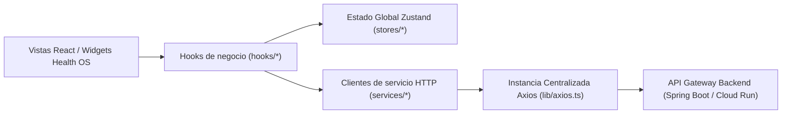

# 04 - Capa de Estado Global, Red HTTP y Servicios API

**Documento:** `docs/architecture/04-state-and-services.md`
**Estado:** Inventario derivado del repositorio; validar comportamiento mediante pruebas y runtime.
**Última actualización:** 2026-09-08
**Público:** Desarrolladores Frontend, Arquitectos Backend y Agentes de IA (`engineering-product`, `platform-security-reliability`)

---

## 1. Introducción y Filosofía de Datos

El frontend de QuHealthy implementa una separación estricta entre el **estado reactivo del cliente** y la **persistencia en el servidor**:



* **Estado de Cliente Efímero y de Sesión:** Gestionado mediante **Zustand** con persistencia selectiva en `localStorage` (sesión de usuario, sala de teleconsulta, sesiones de chat con el Copilot y módulos activos).
* **Capa de Abstracción de Red:** Muchos flujos usan servicios tipados en `services/` y *custom hooks*. Existen componentes y páginas que importan la instancia Axios o Axios directamente; por ello, esta separación es una convención deseada, no una garantía actual.

---

## 2. Capa de Red y Transporte HTTP (`lib/axios.ts` y `lib/idempotency.ts`)

La instancia HTTP compartida está en [`lib/axios.ts`](../../lib/axios.ts); existen además usos directos de Axios que deben evaluarse por flujo:

### A. Configuración Base de la Instancia
```typescript
const axiosInstance = axios.create({
  baseURL: process.env.NEXT_PUBLIC_API_URL || 'https://api.quhealthy.org',
  timeout: 45000,
  headers: {
    'Content-Type': 'application/json',
    Accept: 'application/json',
  },
  withCredentials: true, // ✅ Transmite automáticamente la cookie HttpOnly "refreshToken"
});
```

### B. Interceptores de Solicitud (*Request Interceptors*)
1. **Inyección Automática de Bearer Token:** Obtiene el `token` de acceso en memoria desde `useSessionStore.getState().token` y lo añade a la cabecera `Authorization: Bearer <token>`.
2. **Zona Horaria Dinámica del Usuario:** Inyecta `X-User-Timezone: <Intl.DateTimeFormat().resolvedOptions().timeZone>` en cada petición para que el backend calcule disponibilidades y citas en la hora local exacta del usuario.
3. **Sincronización de Refresh Inicial:** Si la aplicación está inicializando sesión (`isInitialRefreshInProgress`), cualquier petición concurrente espera a que la promesa de refresco se complete antes de salir a la red.

### C. Manejo Automático de Expiración de Token (Cola FIFO de Reintentos)
Cuando el access token expira y el backend retorna un error HTTP `401 Unauthorized`:
1. La petición fallida se suspende y se almacena en `failedQueue`.
2. Si no hay un proceso de refresco activo, se activa la bandera `isRefreshing = true` y se solicita un nuevo access token a `/api/auth/refresh-token`.
3. Al recibir el nuevo token:
   * Se actualiza en `useSessionStore`.
   * Se vacía la cola `failedQueue` y se reintentan las peticiones encoladas con el nuevo token; el objetivo es reducir interrupciones visibles, pero el resultado depende de la red y del backend.
4. Si el refresco falla definitivamente, se limpia la sesión y se ejecuta `nukeCookies()`.

### D. Limpieza Nuclear de Cookies (`nukeCookies()`)
Ubicada en [`stores/SessionStore.ts`](../../stores/SessionStore.ts), esta utilidad intenta borrar cookies accesibles por JavaScript mediante combinaciones de rutas y dominios. Las cookies `HttpOnly` no son accesibles desde JavaScript, por lo que el efecto completo depende del backend y del navegador.

### E. Idempotencia en Operaciones de Escritura (`lib/idempotency.ts`)
Para que los llamadores puedan adjuntar una clave de idempotencia:
```typescript
export const idempotencyHeaders = (key?: string) => ({
  'Idempotency-Key': key ?? crypto.randomUUID(),
});
```
El código actual la adjunta en algunos endpoints de pago y creación de citas. La garantía contra duplicados requiere que el backend persista y aplique la clave; no se infiere únicamente del cliente.

---

## 3. Estado Global con Zustand (`stores/*`)

| Store | Archivo | Persistencia | Propósito y Responsabilidades |
| :--- | :--- | :---: | :--- |
| **`useSessionStore`** | `stores/SessionStore.ts` | `localStorage` | Token de acceso JWT, datos de usuario (`AuthUser`), rol activo (`ROLE_PROVIDER`, `ROLE_CONSUMER`), estado de onboarding (`onboardingComplete`), verificación de correo, y función `switchRoleProfile()` para usuarios con perfil dual (médico y paciente). |
| **`useHealthOSStore`** | `stores/useHealthOSStore.ts` | `localStorage` | Historial de conversaciones del Copilot, sesiones activas múltiples (`sessions[]`), streaming de chunks, adjuntos en Base64, contexto clínico del paciente y lista de widgets renderizados. |
| **`TeleconsultationStore`** | `stores/TeleconsultationStore.ts` | Memoria | Máquina de estados de la sala de teleconsulta (11 estados: `IDLE`, `DEVICE_SETUP`, `CONNECTING`, `CONNECTED`, etc.), streams WebRTC locales y remotos, silenciamiento de audio/video, temporizador del servidor y estado del agente de transcripción. |
| **`useModuleStore`** | `stores/useModuleStore.ts` | `localStorage` | Sistema de *Feature Flags* y módulos clínicos activados por el prestador de salud (diabetes, oncología, finanzas, control biomédico). |
| **`intelligence.store`** | `store/intelligence.store.ts` | Memoria | Estado transitorio de correlaciones y métricas clínicas avanzadas. |

---

## 4. Catálogo Clasificado de Servicios API (`services/*`)

El directorio `services/` contiene clientes HTTP que cubren distintos dominios. El inventario y su tipado deben verificarse contra el árbol actual; no acredita cobertura funcional ni disponibilidad del backend.

### 1. Autenticación, Seguridad y Onboarding (5 servicios)
* `auth.services.ts`: Login, registro por rol, refresh token, recuperación y verificación OTP.
* `onboarding.service.ts`: Orquestador de pasos de alta para todos los actores.
* `security.service.ts`: Gestión de 2FA (TOTP), sesiones activas, cambio de contraseña y alertas.
* `google.service.ts`: Integración con Google OAuth y sincronización de perfiles.
* `approval.service.ts`: Flujo de aprobación administrativa de solicitudes B2B.

### 2. Expediente Clínico Electrónico (EHR) y Consulta (7 servicios)
* `ehr.service.ts`: Historial clínico central, antecedentes patológicos y notas de evolución.
* `diagnosis.service.ts`: Catálogo y codificación de diagnósticos bajo estándar internacional CIE-10.
* `treatment.service.ts`: Prescripción y seguimiento de tratamientos farmacológicos.
* `clinicalTemplates.service.ts`: Plantillas predeterminadas de notas médicas y recetas.
* `clinicalSubmissions.service.ts`: Envío y resguardo de documentación médica firmada.
* `healthVault.service.ts`: **Health Vault:** Expediente del paciente (estudios, recetas, PDFs y acceso controlado).
* `document.service.ts`: Carga y gestión de consentimientos informados y archivos generales.

### 3. Citas, Agenda y Telemedicina (6 servicios)
* `appointment.service.ts`: Creación, reprogramación, cancelación y consulta de citas médicas.
* `schedule.service.ts`: Disponibilidad horaria, bloqueos y excepciones de agenda.
* `teleconsultation.service.ts`: Generación de tokens WebRTC de LiveKit y salas virtuales.
* `calendar-integration.service.ts`: Sincronización bidireccional con Google Calendar.
* `homeVisit.service.ts`: Agendamiento y geolocalización de consultas médicas a domicilio.
* `emergency.service.ts`: Canal de atención prioritaria para pacientes urgentes.

### 4. Programas Clínicos Especializados (9 servicios)
* `diabetes.service.ts`: Bitácora de glucosa en ayunas/postprandial y HbA1c.
* `oncology.service.ts`: Seguimiento de ciclos de quimioterapia y efectos secundarios.
* `womensHealth.service.ts`: Ciclo menstrual, fertilidad y salud reproductiva.
* `eldercare.service.ts`: Control geriátrico, adherencia a medicación y signos vitales del adulto mayor.
* `nutrition.service.ts`: Planes nutricionales, dietas y composición corporal.
* `sportsMedicine.service.ts`: Medicina del deporte, prevención de lesiones y rehabilitación.
* `vaccination.service.ts`: Esquema de vacunación universal y refuerzos.
* `wearable.service.ts`: Integración con relojes y dispositivos de medición continua.
* `biomedical.service.ts`: Inventario, calibraciones y fichas técnicas de equipos médicos.

### 5. Familia y Gestión de Pacientes (4 servicios)
* `dependent.service.ts`: CRUD de familiares dependientes vinculados al titular.
* `consumerProfile.service.ts`: Perfil del paciente (alergias, tipo de sangre, contacto de emergencia).
* `patientDetail.service.ts`: Ficha completa del paciente visible para el médico.
* `patientDirectory.service.ts`: Directorio general y búsqueda de pacientes del consultorio.

### 6. Finanzas, Cobros, POS y Facturación (11 servicios)
* `payment.service.ts`: Pasarela de cobros, transacciones y reembolsos.
* `stripe-connect.service.ts`: Onboarding y dispersión bancaria para médicos vía Stripe Connect.
* `checkout.service.ts`: Motor de checkout para compras de servicios y productos.
* `cfdi.service.ts`: Emisión y timbrado de comprobantes fiscales SAT (CFDI 4.0).
* `accounting.service.ts`: Pólizas contables, catálogo de cuentas y libros de diario.
* `finance.service.ts`: Balances financieros y tesorería de la clínica.
* `cash-register.service.ts`: Control de apertura, cortes y arqueos de caja en recepción.
* `pos.service.ts`: Punto de venta para cobro con tarjeta o efectivo en mostrador.
* `consumer-wallet.service.ts`: Billetera virtual, recargas y saldo de QuPoints.
* `budget.service.ts`: Presupuestos institucionales y control de partidas de gasto.
* `clinical-budget.service.ts`: Cotizaciones médicas y quirúrgicas entregadas a pacientes.

### 7. Farmacia, Proveedores e Insumos B2B (9 servicios)
* `catalog.service.ts`: Catálogo de insumos, medicamentos y material médico.
* `supplier.service.ts`: Operaciones del proveedor (almacén, cadena de frío, cotizaciones RFQ).
* `provider-order.service.ts`: Pedidos de insumos realizados por clínicas.
* `consumer-order.service.ts`: Pedidos de farmacia comprados por pacientes.
* `purchase-order.service.ts`: Órdenes formales de compra a distribuidores mayoristas.
* `store.service.ts`: Tienda y escaparate digital del prestador o clínica.
* `storefront.service.ts`: Configuración pública de vitrinas de productos.
* `package.service.ts`: Membresías y paquetes de servicios de salud.
* `consumer-package.service.ts`: Paquetes y suscripciones activas de pacientes.

### 8. Laboratorios Clínicos (3 servicios)
* `laboratory-operations.service.ts`: Gestión de órdenes, toma de muestras y entrega de resultados.
* `laboratory-onboarding.service.ts`: Validación de acreditaciones y responsable sanitario.
* `compliance.service.ts`: Auditoría de cumplimiento de normativas sanitarias.

### 9. Fundaciones y Programas de Impacto (3 servicios)
* `foundation.service.ts`: Creación y control de programas sociales, beneficiarios y subsidios.
* `foundation-onboarding.service.ts`: Acreditación legal de donatarias autorizadas.
* `social.service.ts`: Red comunitaria, voluntariado y campañas públicas.

### 10. Inteligencia Artificial y Health OS (4 servicios)
* `healthOS.service.ts`: Envío de intenciones, contexto y adjuntos al orquestador AI (`/api/v1/health-agent/intent`).
* `ai.service.ts`: Servicios complementarios de procesamiento de lenguaje natural.
* `catalogAiService.ts`: Búsqueda semántica asistida de insumos y tratamientos.
* `intelligence.service.ts`: Generación de insights y analítica predictiva.

### 11. Educación Continua y Academia (3 servicios)
* `consumer-course.service.ts`: Compra y acceso a cursos de salud.
* `course-curriculum.service.ts`: Módulos, lecciones y temarios de cursos.
* `course-progress.service.ts`: Seguimiento del avance académico del alumno.

### 12. Administración, Analítica y Soporte (12 servicios)
* `admin.service.ts`: Monitoreo integral de la plataforma para superadministradores.
* `analytics.service.ts`: Métricas agregadas de uso, retención y comportamiento.
* `healthscore.service.ts`: Algoritmo y cálculo del índice QuScore del paciente.
* `providerScore.service.ts`: Calificación y reputación profesional del especialista.
* `dashboard.service.ts`: Resúmenes ejecutivos para los diferentes dashboards.
* `active-modules.service.ts`: Consulta de módulos y complementos habilitados.
* `growth.service.ts`: Métricas de conversión y experimentos de adquisición.
* `referral.service.ts`: Programa de interconsultas y referencias entre médicos.
* `review.service.ts`: Moderación y publicación de valoraciones de pacientes.
* `storage.service.ts`: Carga de archivos hacia Google Cloud Storage.
* `location.service.ts`: Geocodificación y catálogo de direcciones.
* `chat.service.ts`: Mensajería directa entre consultorios y pacientes.

---

## 5. La Capa de Abstracción: Custom Hooks (`hooks/*`)

Los **Custom Hooks** actúan como intermediarios entre la interfaz de usuario y los servicios HTTP:

### Principales Responsabilidades de los Hooks:
1. **Gestión de Carga y Errores:** Manejan estados `isLoading`, `error` y respuestas exitosas mediante hooks reactivos o SWR.
2. **Notificaciones al Usuario:** Disparan alertas inmediatas mediante toasts (`sonner` o `react-toastify`) ante fallos o éxitos de red.
3. **Cohesión de Dominio:** Por ejemplo, [`useBookingCheckout`](../../hooks/useBookingCheckout.ts) concentra parte de la selección de dependientes, validación de síntomas, verificación de saldo y llamadas de checkout. Sus límites efectivos deben validarse contra el código y pruebas.
