# 05 - Integraciones Externas y Servicios de Terceros

**Documento:** `docs/architecture/05-integrations.md`
**Estado:** Activo / Exhaustivo
**Última actualización:** 2026-09-08
**Público:** Desarrolladores Fullstack, Ingenieros de Plataforma y Agentes de IA (`engineering-product`, `platform-security-reliability`)

---

## 1. Mapa de Integraciones Externas

El repositorio contiene integraciones y referencias a los siguientes proveedores. Su habilitación, disponibilidad, seguridad clínica y cumplimiento deben verificarse por entorno:

```mermaid
flowchart TD
    Frontend["QuHealthy Frontend (Next.js 16)"]

    subgraph Communications ["Comunicaciones y Telemedicina"]
        Frontend -->|"WebRTC / SFU Video 720p"| LiveKit["LiveKit Cloud / Server<br>(Teleconsulta + Audio Agent IA)"]
        Frontend -->|"Emails transaccionales"| Resend["Resend API<br>(Confirmaciones y Recetas)"]
        Frontend -->|"Atención en vivo"| Chatwoot["Chatwoot Widget<br>(Soporte a Usuarios)"]
    end

    subgraph Payments ["Finanzas y Dispersión"]
        Frontend -->|"Checkout de Citas e Insumos"| Stripe["Stripe Elements & Checkout<br>(Tarjetas y Meses sin Intereses)"]
        Frontend -->|"Onboarding y Dispersión a Médicos"| StripeConnect["Stripe Connect Express<br>(Cuentas Bancarias de Doctores)"]
    end

    subgraph IdentityGeo ["Identidad, Seguridad y Mapas"]
        Frontend -->|"Login federado en 1 clic"| GoogleOAuth["Google Identity Services<br>(OAuth 2.0)"]
        Frontend -->|"Validación anti-bot invisible"| Turnstile["Cloudflare Turnstile<br>(Seguridad en Formularios)"]
        Frontend -->|"Geocodificación y Consultorios"| GoogleMaps["Google Maps & Places API<br>(Directorio y Visitas a Domicilio)"]
    end
```



---

## 2. Telemedicina en Tiempo Real: LiveKit (WebRTC)

La integración de telemedicina está implementada en el custom hook [`useLiveKitVideo.ts`](../../hooks/useLiveKitVideo.ts) y el store [`TeleconsultationStore.ts`](../../stores/TeleconsultationStore.ts):

### A. Flujo de Conexión y Autenticación
1. El frontend solicita un token de acceso seguro a la sala llamando a `teleconsultation.service.ts` (`/api/teleconsultation/token?appointmentId=...`).
2. El backend emite un JWT firmado que contiene los permisos de la sala, identidad del participante y rol (`PATIENT` o `PROVIDER`).
3. El hook `useLiveKitVideo` conecta al WebSocket seguro de LiveKit (`wss://livekit.quhealthy.org`).

### B. Optimización de Ancho de Banda y Simulcast
```typescript
const room = new Room({
  videoCaptureDefaults: {
    resolution: VideoPresets.h720.resolution, // Calidad médica HD 720p
  },
  publishDefaults: {
    simulcast: true, // ✅ Ajusta dinámicamente la resolución si el internet del paciente fluctúa
  },
});
```

### C. Soporte para el Agente de Audio con Inteligencia Artificial
LiveKit detecta participantes especiales con `ParticipantKind.AGENT`:
```typescript
const hasAgent = Array.from(room.remoteParticipants.values()).some(
  p => p.kind === ParticipantKind.AGENT
);
setAiAgentActive(hasAgent);
```
Esto permite la coexistencia en la misma sala del médico, el paciente y un **Agente de Voz IA** que asiste en la transcripción en tiempo real o en traducción simultánea.

---

## 3. Pagos y Dispersión Financiera: Stripe & Stripe Connect

QuHealthy implementa dos capas de integración con Stripe:

### A. Stripe Checkout / Elements (Cobro al Paciente)
* Utilizado en la reserva de citas médicas y compras en el marketplace.
* **Claves de idempotencia:** [`lib/idempotency.ts`](../../lib/idempotency.ts) construye `Idempotency-Key` (UUIDv4) para los flujos que la invocan. Esto no demuestra cobertura de toda transacción ni la desduplicación en Stripe o el backend.
* **Modelo Híbrido:** Admite pagos combinados con saldo de **QuPoints** (descuento directo en la orden antes de procesar el remanente en tarjeta).

### B. Stripe Connect Express (Dispersión a Médicos y Clínicas)
Implementado en [`services/stripe-connect.service.ts`](../../services/stripe-connect.service.ts):
1. **Onboarding Bancario:** El médico inicia el alta desde `/provider/settings` llamando a `stripeConnectService.startOnboarding()`, lo que genera un enlace mágico de Stripe para el registro de su CLABE interbancaria y verificación KYC ante la entidad bancaria.
2. **Validación de Estado (`getAccountStatus`):** El sistema consulta si la cuenta del médico está en estado `charges_enabled` y `payouts_enabled` antes de permitirle publicar tarifas y recibir pagos de consultas en su perfil público.

---

## 4. Geolocalización y Mapas: Google Maps & Places

Gestionado mediante `@react-google-maps/api` y los hooks [`useGoogleAutocomplete.ts`](../../hooks/useGoogleAutocomplete.ts) y [`useGeolocation.ts`](../../hooks/useGeolocation.ts):

* **Directorio de Especialistas:** Muestra la ubicación geográfica precisa de consultorios y clínicas cercanas al código postal del paciente.
* **Visitas Médicas a Domicilio (`homeVisit.service.ts`):** Sugerencia y normalización de la dirección con Places Autocomplete. La precisión de las coordenadas debe validarse y no se infiere únicamente de usar la API.

---

## 5. Seguridad Anti-Bot: Cloudflare Turnstile

Integrado mediante `@marsidev/react-turnstile` en los formularios sensibles de la plataforma:
* Formulario de Registro por Rol (`/register`, `/provider/register`, `/supplier/register`).
* Inicio de Sesión (`/login`, `/provider/login`, `/admin/login`).
* Formulario de Contacto y Soporte (`/contact`).

**Comportamiento documentado por el proveedor:** Turnstile puede resolver muchas interacciones sin desafíos visuales. Sus propiedades de privacidad, telemetría y configuración efectiva deben validarse contra la documentación vigente y el entorno de QuHealthy.

---

## 6. Autenticación Federada: Google OAuth

* Implementado con `@react-oauth/google` y [`services/google.service.ts`](../../services/google.service.ts).
* Permite el inicio de sesión y registro en un solo clic para pacientes, recibiendo el `credential` (ID Token JWT de Google) y enviándolo al endpoint `/api/auth/google` de `auth_service` para emitir la sesión interna de QuHealthy.

---

## 7. Comunicaciones y Soporte: Resend & Chatwoot

* **Resend:** Utilizado para el envío confiable de correos electrónicos transaccionales: confirmación de reserva, enlace para unirse a la teleconsulta, código de recuperación de contraseña y notificación de resultados de laboratorio.
* **Chatwoot:** Plataforma prevista para atención y soporte en vivo. La CSP en `next.config.ts` permite cargar recursos desde `https://app.chatwoot.com`; esto no demuestra que el widget esté configurado, disponible ni operativo en producción.

---

## 8. Resumen de Variables de Entorno

| Variable | Alcance | Propósito |
| :--- | :--- | :--- |
| `NEXT_PUBLIC_API_URL` | Público | URL del API Gateway en Google Cloud Run |
| `NEXT_PUBLIC_GOOGLE_CLIENT_ID` | Público | Client ID para Google OAuth 2.0 |
| `NEXT_PUBLIC_GOOGLE_MAPS_API_KEY` | Público | Clave de acceso a mapas y Places Autocomplete |
| `NEXT_PUBLIC_TURNSTILE_SITE_KEY` | Público | Site Key de Cloudflare Turnstile |
| `NEXT_PUBLIC_LIVEKIT_WS_URL` | Público | Servidor WebSocket de LiveKit |
| `NEXT_PUBLIC_STRIPE_PUBLISHABLE_KEY` | Público | Llave pública de Stripe para inicializar Elements |
