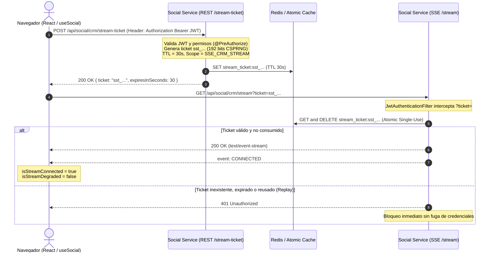

# ADR-STREAM-SEC-01: Ephemeral Stream Tickets para Server-Sent Events (SSE)

## Estado
Aprobado e Implementado

## Contexto y Modelo de Amenazas

### 1. El Problema AS-IS
En la implementación previa del CRM Omnicanal en Quhealthy:
- El hook `hooks/useSocial.ts` y la vista `SocialMessagesView.tsx` abrían conexiones SSE mediante:
  ```javascript
  new EventSource(`${SSE_BASE_URL}/api/social/crm/stream?token=${token}`)
  ```
- El backend `JwtAuthenticationFilter.java` extraía el JWT persistente de sesión directamente desde el query string: `request.getParameter("token")`.
- La URL base de Cloud Run (`https://social-service-629639328783.us-central1.run.app`) estaba hardcodeada en el frontend.

### 2. Modelo de Amenazas Identificado
1. **Fuga en Logs de Ingress / Load Balancer**: Los query parameters (`?token=<JWT>`) quedan registrados en texto claro en logs de acceso de Google Cloud Load Balancer, Cloud Run Ingress y proxies intermedios.
2. **Historial del Navegador y Referer Headers**: Las URLs con tokens persisten en el historial del cliente y pueden filtrarse en el header `Referer` hacia orígenes externos.
3. **Persistencia Indebida de Credenciales**: El token expuesto en la URL era el JWT de sesión principal con larga duración (1-8 horas) y privilegios amplios de usuario/médico.
4. **Acoplamiento Rígido de Entorno**: La URL fija a Cloud Run rompía la portabilidad entre entornos (local, staging, producción) y creaba dependencia cruzada.

---

## Limitación Técnica Fundamental de EventSource
La API estándar de los navegadores `EventSource` **no permite** enviar headers HTTP personalizados (como `Authorization: Bearer <token>`).

Se evaluaron dos alternativas:
1. **Opción A: Cookies `HttpOnly` / `SameSite`**:
   - Descartada debido a que el Frontend (Vercel) y el Backend (Google Cloud Run) se encuentran en dominios/orígenes diferentes en staging y producción. Los navegadores modernos bloquean cookies de terceros (Third-Party Cookies) y obligaría a modificar dominios DNS productivos o relajar CSP/CORS, violando la restricción obligatoria de no tocar cookies/dominios productivos.
2. **Opción B: Ephemeral Stream Ticket (Seleccionada)**:
   - Patrón de token efímero de corta duración (30 segundos), de un solo uso (single-use / atomic consumption), alcance restringido exclusivamente a SSE (`SSE_CRM_STREAM`), e intransferible.

---

## Decisión de Arquitectura

### 1. Flujo de Handshake Criptográfico


### 2. Mitigación de Ataques de Replay
- La función `consumeTicket` consume el ticket atómicamente (`redisTemplate.opsForValue().getAndDelete()` o `localTicketStore.remove()`).
- Si un atacante intercepta la URL del ticket de un log, cualquier intento de conexión posterior devuelve `null` y es rechazado con `401 Unauthorized`.
- Si el stream se desconecta de forma legítima, el cliente nunca reutiliza el ticket anterior; siempre solicita un ticket fresco antes de reconectar.

### 3. Desacoplamiento de Origen
- Se eliminó completamente la constante `SSE_BASE_URL` fija.
- La URL base se resuelve dinámicamente mediante `NEXT_PUBLIC_SOCIAL_SERVICE_URL || NEXT_PUBLIC_API_URL || ''`.

### 4. Ciclo de Vida y Modo Degradado
- Reconexión automática con backoff exponencial (`Math.min(1000 * 2^retries, 15000)`).
- Al desconectarse, el hook activa visiblemente `isStreamDegraded = true` e `isStreamConnected = false`, evitando simular tiempo real si el transporte no está sincronizado.
- En unmount o cierre de sesión, se cancelan los timers de reconexión y se cierra limpiamente el `EventSource`.

---

## Consecuencias y Validación

- **Seguridad**: Se eliminó al 100% la presencia de JWTs de sesión en query strings, logs de acceso y proxies.
- **CORS / CSP**: No se requirió abrir comodines ni modificar la política de seguridad existente.
- **Pruebas Automatizadas**:
  - Backend: `SocialCrmStreamSecurityTest` valida emisión, consumo atómico, bloqueo de replay y control de acceso.
  - Frontend: `StreamSecurity.test.tsx` valida resolución de env vars, ausencia de JWT en URLs, transición de estados y reconexión con ticket nuevo.
