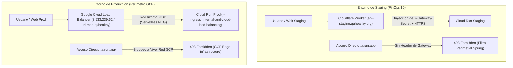

# Especificación Técnica: Blindaje del Perímetro de Red y Control de Ingress en Cloud Run

**HU:** `OPS-NET-INGRESS-01`  
**Épica:** `EP-TECH-01` / Plataforma, Redes y DevSecOps  
**Prioridad:** P1  
**Entornos:** Google Cloud Run (`quhealthy-backend` y `quhealthy-staging`)  
**Fecha:** 2026-10-06  
**Estado:** Especificación Aprobada para Ejecución por Fases  

---

## 1. Problema de Seguridad (AS-IS)

Actualmente, los 12 microservicios desplegados en Google Cloud Run tienen su configuración de Ingress en **`all`** (`--ingress=all`).

### Riesgos Identificados:
1. **Evasión del Perímetro (Bypass de WAF y Gateway):**
   * Un atacante que descubra o infiera las URLs directas de Cloud Run (`https://<servicio>-<hash>-uc.a.run.app`) puede enviar peticiones directamente al contenedor, evadiendo los controles de rate-limiting, filtrado WAF y políticas CORS gestionadas en Cloudflare o Cloud Load Balancer.
2. **Denegación de Servicio por Cold-Start (Exhaustion de Recursos):**
   * Peticiones directas no filtradas pueden despertar réplicas en Cloud Run, generando costos innecesarios y saturación de conexiones en el pool de Supabase.

---

## 2. Solución Arquitectónica Objetivo (TO-BE)

La estrategia de blindaje se divide según el modelo de red de cada entorno:



---

## 3. Plan de Implementación por Entorno

### A. Entorno de Producción (`quhealthy-backend`)

Producción ya cuenta con un **External Application Load Balancer** aprovisionado (`quhealthy-api-ip` / `url-map-quhealthy`), el cual se comunica con Cloud Run mediante Serverless Network Endpoint Groups (NEGs).

#### 1. Configuración de Ingress en Cloud Run
Se ejecutará la transición gradual de Ingress a `internal-and-cloud-load-balancing`:
```bash
gcloud run services update <SERVICE_NAME> \
  --ingress=internal-and-cloud-load-balancing \
  --project=quhealthy-backend \
  --region=us-central1
```

#### 2. Orden de Despliegue Gradual (Menor a Mayor Riesgo):
1. **Fase 1 (Lectura / Bajo Impacto):** `analytics-service`, `catalog-service`, `review-service`.
2. **Fase 2 (Soporte y Auxiliares):** `referral-service`, `notification-service`, `health-agent-service`, `admin-service`.
3. **Fase 3 (Core Transaccional):** `onboarding-service`, `auth-service`, `appointment-service`, `social-service`, `payment-service`.

#### 3. Criterio de Verificación en Producción:
* **Prueba Positiva:** Petición a través de `api.quhealthy.org` responde `200 OK`.
* **Prueba Negativa:** Petición directa a `https://<servicio>-ayzpmwrdkq-uc.a.run.app` es rechazada inmediatamente con `403 Forbidden` por la infraestructura de GCP **sin despertar el contenedor**.

#### 4. Plan de Rollback Inmediato:
En caso de que el balanceador presente inconsistencias en algún microservicio:
```bash
gcloud run services update <SERVICE_NAME> \
  --ingress=all \
  --project=quhealthy-backend \
  --region=us-central1
```

---

### B. Entorno de Staging (`quhealthy-staging`)

Para preservar la directriz de **FinOps \$0 de costo en reposo** en Staging (evitando los ~\$25 USD/mes del balanceador externo de Google en este ambiente de pruebas), se implementa **Defensa en Profundidad en Capa de Aplicación**:

#### 1. Inyección de Firma de Gateway en Cloudflare Worker
En `infrastructure/cloudflare-staging-gateway/worker.js`:
```javascript
forwardHeaders.set("X-QuHealthy-Gateway-Secret", env.GATEWAY_SECRET);
```

#### 2. Filtro Perimetral en `shared-libs` (Spring Security)
Se incorpora un filtro perimetral en Spring Security (`GatewaySecretValidationFilter`) que evalúa la presencia de la cabecera compartida:
* Si la petición proviene de `api-staging.quhealthy.org`, la cabecera es validada y la petición procede.
* Si un cliente intenta llamar directamente al subdominio `.a.run.app`, el filtro retorna `403 Forbidden (Direct Access Not Permitted)`.

---

## 4. Criterios de Aceptación Formale

- [ ] Matriz de verificación probada en Staging y Producción para los 12 microservicios.
- [ ] Las URLs directas `.a.run.app` devuelven `403 Forbidden` ante solicitudes no autorizadas.
- [ ] Los dominios autorizados (`staging.quhealthy.org`, `www.quhealthy.org`, `api-staging.quhealthy.org`, `api.quhealthy.org`) operan con 100% de disponibilidad y sin latencia añadida.
- [ ] Rollback probado y validado con comando documentado en menos de 60 segundos.
